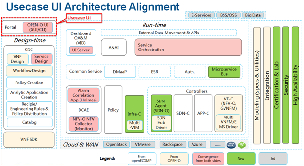

.. This work is licensed under a Creative Commons Attribution 4.0 International License.
.. http://creativecommons.org/licenses/by/4.0

Usecase UI Architecture
-----------------
Following is the Usecase UI architecture.

|image0|

   
Usecase UI as the GUI of ONAP Use Case includes two parts UI and UI Server.
UI provides Graphical User Interface (GUI) for operators and end-users to show service lifecycle information and system monitor information. And operators could implement service LCM via UI pages.
UI Server analyze CSAR files which get from SDC catalog and implement service LCM (instantiation and termination) by calling SO interfaces.
