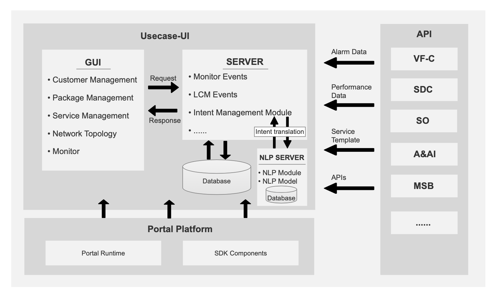

.. This work is licensed under a Creative Commons Attribution 4.0 International License.

Architecture
------------

Usecase-Ui comprises two modules: the Usecase-UI UI module and the Usecase-UI Server module.

- Holmes
    - Usecase-UI UI Module
    - Usecase-UI Server Module

ONAP-level Architecture
^^^^^^^^^^^^^^^^^^^^^^^

Usecase-UI itself is an independent component in ONAP, which means it could be deployed as an ONAP-level component.

.. image:: images/overall-architecture-in-onap.png

Usecase-UI Architecture
^^^^^^^^^^^^^^^^^^^

Take a deep dive into Usecase-UI, we could see it mainly consists of two modules, which are the UI module and Server module respectively. 

The UI module provides Graphical User Interface (GUI) for operators and end-users (e.g. LCM, Monitor).

The Server module is the logic part of Usecase-UI. This part analyzes NS files for LCM function and subscribes vnf alarm and performance data for monitor function.

