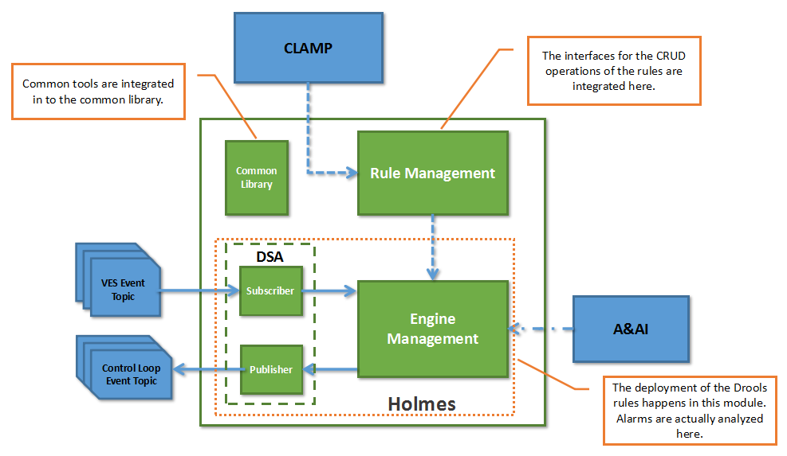

.. This work is licensed under a Creative Commons Attribution 4.0 International License.

Delivery
--------

Describe how functions are packaged into run-time components. For some components a block diagram may be useful.
As mentioned in the architecture chapter, Holmes mainly comprises three modules: the rule management module, the engine management module and the data source adapter. But due to the imperfect implemetation of the DCAE platform, the engine management module and the data source adapter are hosted in a single docker. From this point of view, Holmes in the Amsterdam release actually consists of two main modules.

* Rule Management Docker: The main operations on the rules are performed in this module. The module provides CRUD operation interfaces and is reponsible of the persistence of the rules as well.

* Engine Management Docker: The Drools rules are actually deployed into the Drools engine which is embedded within the engine management module. The analysis tasks are excuted in this module as well. Ideally, the data source adapter is supposed to be running as a standalone docker and communicate with the engine management module via MQ (or any other message bus). But in the Amsterdam release, due to the limitation of the DCAE platform. These two modules are merged into one and interact with each other directy in the manner of Java API calls.

* Common Library: The library hosts some supportive tools for both the rule management module and the engine management module. It is not run separately. Instead, it is introduced into the main modules of Holmes during the compile and package phase.

