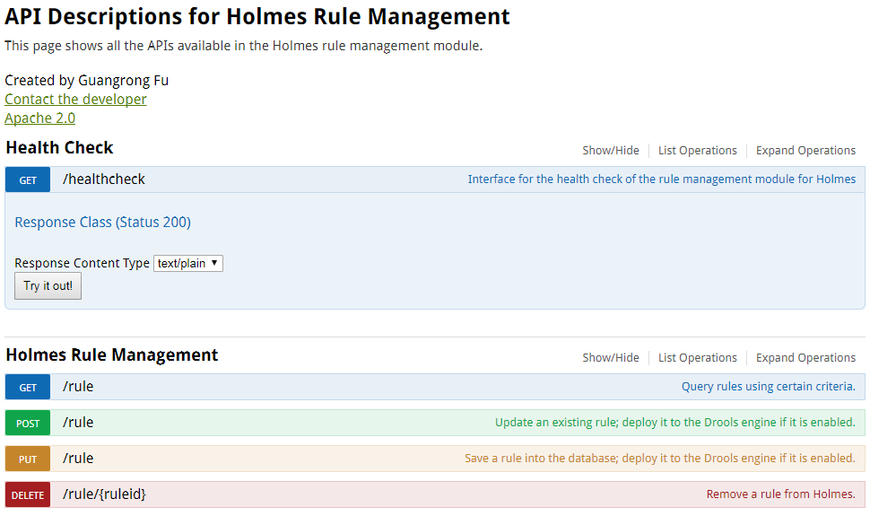

.. This work is licensed under a Creative Commons Attribution 4.0 International License.
.. http://creativecommons.org/licenses/by/4.0

Human Interfaces
----------------

Target Users
^^^^^^^^^^^^

The human interfaces provided in the Amsterdam release by Holmes is intended for the developers rather than the end users.

Interface Type
^^^^^^^^^^^^^^

The interfaces of Holmes is more like a Swagger GUI, which is supported by MSB and used by the developers or system engineers for debugging or testing. They could use the GUI instead of the ``curl`` command or Postman to call the RESTful APIs of Holmes.

Access
^^^^^^

Go to the MSB interface with a browser, using the address ``http://${msb-ip}:${msb-port}/iui/microservices/default.html``. Select the "API Service" tab (which is opened by default), then you can see all the registered microservices. Click on the microservice block of which the name is *holmes-rule-mgmt* and the APIs will be displayed in the browser. Select the corresponding interface and details will be expanded. Users could use the interface to send http request to the Holmes server to perform health check or other operations on the rules.

**Direct calling of the APIs in the engine management module of Holmes is not recommended becasue it would cause data inconsistency between the rule managment module and the engine management module. All rules related operations should be only conducted on the rule management module.**
