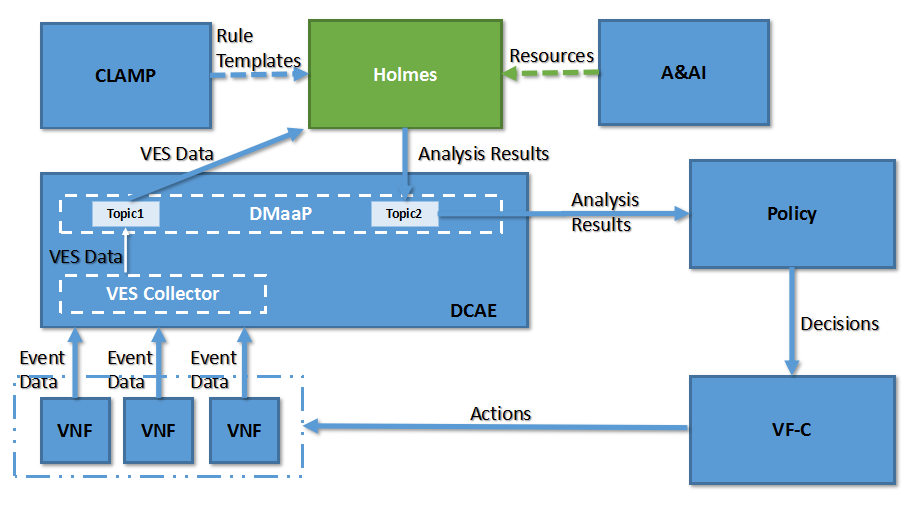

.. This work is licensed under a Creative Commons Attribution 4.0 International License.
.. http://creativecommons.org/licenses/by/4.0

.. _uui_index:

Usecase-UI
==========

|image0|

Usecase-UI provides self-service management GUI and monitor GUI for operators and end-users. 
This project targets identifying all GUI requirements which operators and end-users need ONAP to support, 
coordinating GUI parts of each ONAP subsystem, filling the gaps for improving GUI functionalities for use cases.

* support customer and service type management GUI
* support E2E instance lifecycle management GUI
* support NS instance lifecycle management GUI
* support NS/VNF/PNF package management GUI
* support network management GUI for OTN Domain

Usecase UI is composed of two parts that are usecase-ui and usecase-ui-server.

* Usecase UI (Frontend)

	* providing customer and service type management GUI
	* providing E2E instance lifecycle management GUI
	* providing NS instance lifecycle management GUI
	* providing NS/VNF/PNF package management GUI
	* providing network management GUI for OTN Domain

* Usecase UI Server (Backend)

	* providing postgreSQL for recording instance operation history
	* providing template analysis result via calling modeling parser
	* providing the way to call ONAP other components APIs

.. toctree::
   :maxdepth: 2

   architecture.rst
   offered_api.rst
   consumed_api.rst
   delivery.rst
   logging.rst
   installation/index
   administration.rst