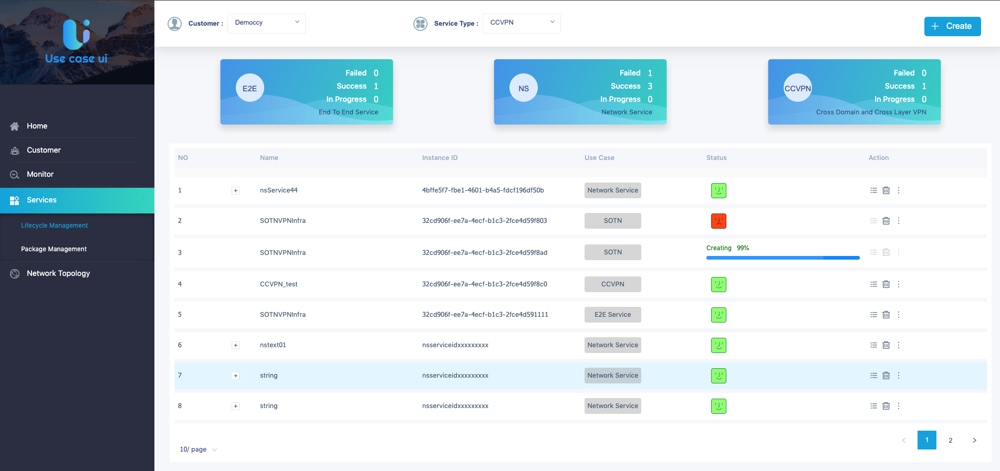
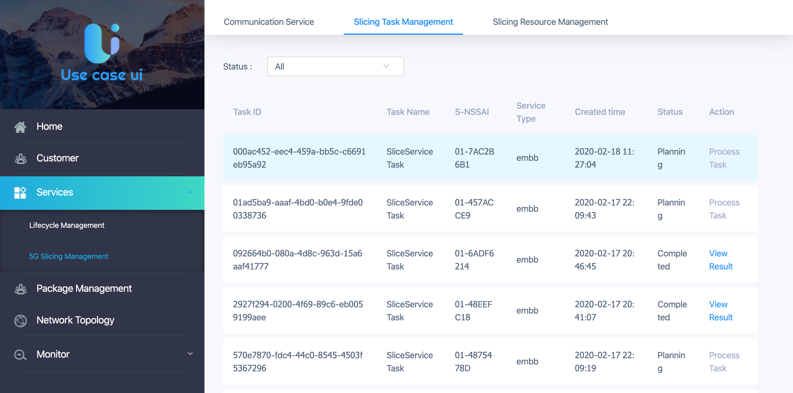
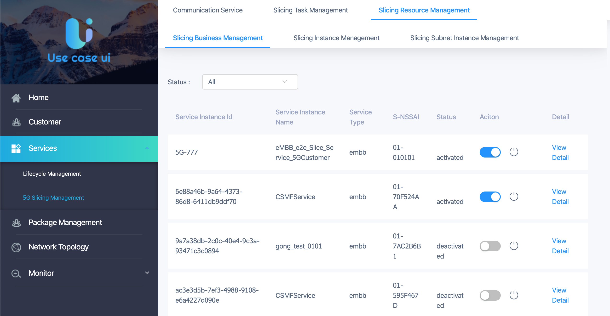

.. contents::
   :depth: 3
..

**1. Confirm Usecase-UI MicroService**
======================================

Confirm that the Usecase-UI microservice has been successfully registered in MSB with OOM.

**2. Register Usecase-UI MicroService**
=======================================

If Usecase-UI microservice does not exist in MSB, please register them manually.
::
   
    curl -k -X POST -H "Content-Type: application/json" -d '{"serviceName": "usecaseui-ui", "version": "v1", "url": "/usecase-ui","path": "/iui/usecaseui","protocol": "UI", "enable_ssl": true, "nodes": [{"ip": "${UUI_IP}","port": "8443"}]}' "https://${MSB_IP}:30283/api/microservices/v1/services"
    curl -k -X POST -H "Content-Type: application/json" -d '{"serviceName": "usecaseui-server", "version": "v1", "url": "/api/usecaseui-server/v1","protocol": "REST", "enable_ssl": true, "nodes": [{"ip": "${UUI_SERVER_IP}","port": "8082"}]}' "https://${MSB_IP}:30283/api/microservices/v1/services"

**3. Open Usecase-UI Home**
===========================

Please open Usecase-UI dashboard page through your browser.

::

  http://${MSB_IP}:30280/iui/usecaseui/
  https://${MSB_IP}:30283/iui/usecaseui/
  
**4. Specific Pages Function**
==============================

Usecase-UI project consists of 5 modules which are *Home*, *Cusomer*, *Monitor*, *Services* and *Network Topology*. 

*4.1. Home Module*

|homepage|

*Home* module is the entrance of the whole project. In this module, users can have a glimpse of the general infomation of specific modules. e.g. the **SERVICES** block shows the general statistic data of *Lifecycle management* module and the **PACKAGE** block shows the total numbers of NS, VNF and PNF which are shown in *Package Management* module. Also, the **ALARM** and **VM PERFORMANCE** block show the infomation of system alarm. If users need more, the ``View Details`` button will help.

*4.2. Cusomer Module*

|customer|

.. |customer| image:: ../../images/usecaseui-architecture-customer.png
   :width: 7.97047in
   :height: 3.63208in

*4.3. Services Module*

This module consists of two parts. One is Lifecycle Management, the other is 5G Slicing Management.

* Lifecycle Management

|lifecycle|

In Frankfurt Release, MDONS instance has been added to the orginal service type. Click the following link to see more detal:
https://wiki.onap.org/display/DW/UUI

* 5G Slicing Management

This module consists of two parts. 
The first part is CSMF component which provides the functions of creating network slicing and displaying the created slicing. Also, customers can use this page to activate, deactivate and terminate the slicing. 
In Honolulu Release, the coverageArea number param is added. Users could input the grid numbers to specify the area where they want the slicing service to cover. For Coverage Area Number, please enter the rectangle grid numbers corresponding to the physical coverage areas on the sample image shown on GUI.

Note: The sample image file is named as 'coverageAreaMap.png' and it is stored in the frontend project of usecase-ui: ``usecase-ui\usecaseui-portal\src\assets\images\coverageAreaMap.png``. If the map of a different region is required, you can replace the sample image with the same name in the frontend project. And you also need to re-release the frontend project docker container.

|CSMF Management Page|

|Create CSMF Slicing|

The second part is NSMF component which includes two different modules.

|Slicing Task Management|

This module is responsible for presenting the tasks created in CSMF portal and processing those tasks. 

|Slicing Resource Management|

This module is responsible for listing all the NS, NSI and NSSI resource and showing the relation between them.

*4.4. Package Management*

|package|

.. |package| image:: ../../images/package-manage.png
   :width: 7.97047in
   :height: 3.63208in

*4.5. Network Topology Module*

*4.6. Monitor Module*

This module is responsible for presenting all kinds of monitoring information. In Frankfurt Release, 5G Slicing monitoring data can be present.   

|Slicing Monitor|

.. |Slicing Monitor| image:: ../../images/slicing-monitor.png
   :width: 7.97047in
   :height: 3.63208in
