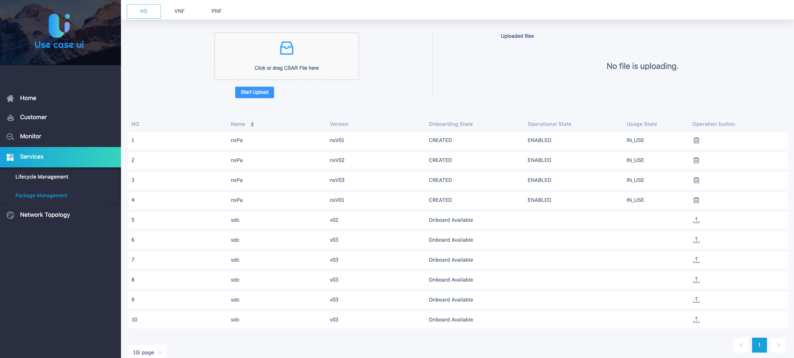

.. contents::
   :depth: 3
..

**1. Confirm Usecase-UI MicroService**
======================================

Confirm that the Usecase-UI microservice has been successfully registered in MSB with OOM.

**2. Register Usecase-UI MicroService**
=======================================

If Usecase-UI microservice does not exist in MSB, please register them manually.
::
            
    curl -X POST -H "Content-Type: application/json" -d '{"serviceName": "usecaseui-server", "version": "v1", "url": "/api/usecaseui-server/v1","protocol": "REST", "nodes": [{"ip": "${UUI_SERVER_IP}","port": "8082"}]}' "http://${MSB_IP}:30280/api/microservices/v1/services"
    curl -X POST -H "Content-Type: application/json" -d '{"serviceName": "usecaseui-ui", "version": "v1", "url": "/usecase-ui","path": "/iui/usecaseui","protocol": "UI", "nodes": [{"ip": "${UUI_IP}","port": "8080"}]}' "http://${MSB_IP}:30280/api/microservices/v1/services"

**3. Open Usecase-UI Home**
===========================

Please open Usecase-UI dashboard page through your browser.

::

  http://${MSB_IP}:30280/iui/usecaseui/
  
**4. Specific Pages Function**
==============================

Usecase-UI project consists of 5 modules which are *Home*, *Cusomer*, *Monitor*, *Services* and *Network Topology*. 

*4.1. Home Module*

|homepage|

.. |homepage| image:: images/usecaseui-architecture-homepage.png
   :width: 5.97047in
   :height: 3.63208in

*4.2. Cusomer Module*

*4.3. Monitor Module*

*4.4. Services Module*

This module consists of two parts. One is lifecycle management, the other is package management.

* Lifecycle Management

|lifecycle|

.. |lifecycle| image:: ../../images/lifecycle-manage.png
   :width: 5.97047in
   :height: 3.63208in

* Package Management

|package|

*4.5. Network Topology Module*

